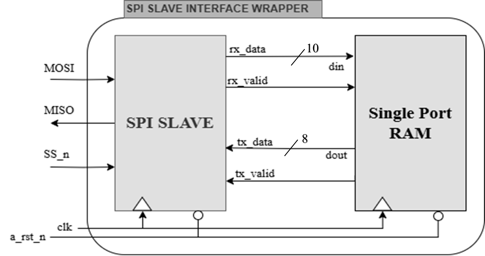

# Project Overview: SPI Slave with Single-Port Synchronous RAM

## Outline
This project involves designing and implementing an SPI Slave module integrated with a Single-Port Synchronous RAM using Verilog. The project demonstrates the use of SPI communication to interface with RAM, showcasing the design specifications, implementation details, and simulation results.

## Tools
- ModelSim
- Xilinx Vivado

## Design Specifications

The design of the SPI Slave with Single-Port Synchronous RAM involves several critical components and configurations, outlined as follows:

### FSM Encoding

The FSM is implemented with one-hot encoding for simplicity and efficiency in FPGA implementations.

```verilog
/* Defining FSM States Parameters */
localparam IDLE = 5'b00001;
localparam CHK_CMD = 5'b00010;
localparam WRITE = 5'b00100;
localparam READ_ADD = 5'b01000;
localparam READ_DATA = 5'b10000;

/* Register for Next and Current States */
(* fsm_encoding = "one-hot" *)
reg [4:0] CS, NS;
````

### Data Ports
- **`din (10-bit)`**: Data input to be written to the RAM.
- **`dout (10-bit)`**: Data output read from the RAM.
- **`Addr_wr (8-bit)`**: Write address for the RAM.
- **`Addr_rd (8-bit)`**: Read address for the RAM.
- **`MOSI`**: Master Out Slave In signal for SPI.

### Control Input Ports
- **`clk`**: Clock signal.
- **`a_rst_n`**: Active-low reset signal.
- **`SS_n`**: Slave select signal for SPI.

### Output Ports
- **`MISO`**: Master In Slave Out signal for SPI.

## Overall Block Diagram
<p align="center">
    
</p>

## Codes
- [Design Codes](/01_Verilog%20Design)
- [Testbench Codes](/02_Verolog%20Testbench)

## Results

### Waveform
* [Testbench Waveform](/03_Simulation%20Snippets/Waveform)
* [Data Memory](03_Simulation%20Snippets/Memory%20Data)

### Elaboration
* [Elaboration](04_Elaboration%20Design/RTL_Schematic.png)
<p align="center">
    
</p>

### Synthesis
* [Synthesis Schematic](05_Synthesis/Synthesis_Schematic.png)

### Implementation
* [Implementation Schematic](06_Implementation/implementation.pdf)


## Resources 
This comprehensive specification ensures the SPI Slave with Single-Port Synchronous RAM is optimally configured for effective SPI communication and RAM interfacing. For more information, Go to the project documentation and user guides. 

* [Project Documentation](Youssef_Ekramy_Project2.pdf)
